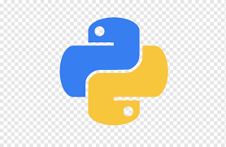

# DjangoStore

<p>Application that will give users opportunities to take a look of listed products, see detailed information about specific items, purchase items, see order information and many more.
</p>

1. **localhost/ main page.**
2. **localhost/category/category_slug/ lists products corresponding to category.**
<p>if no slug presents, default value is passed</p>

3. **localhost/product/product_slug/ product detailed page.**
<p>if no slug presents, default value is passed</p>

4. **localhost/contact/ contact page.**
5. **localhost/order/cart displays cart page.**
6. **localhost/order/checkout/ displays checkout page.**

<p>Site has superuser (user:admin, pass:admin123). you can visit localhost/admin and log in to dashboard.</p>

### Table of Contents

- [Prerequisites](#prerequisites)
- [Getting Started](#getting-started)

### Prerequisites

-  _Python @3.X and up_
-  _Django @5.X and up_

#

### Getting Started

1. **Clone the repository**:

   ```bash
   git clone https://github.com/NikaKhiz/django-store.git
   cd django-store
   ```

2. **Create a virtual environment**:

   ```bash
   python -m venv venv
   ```

   or

   ```bash
   python3 -m venv venv
   ```

3. **Activate the virtual environment**:

   - On Windows:
     ```bash
     venv\Scripts\activate
     ```
   - On macOS/Linux:
     ```bash
     source venv/bin/activate
     ```

4. **Install django and necessary libraries**:
   ```bash
   pip install -r requirements.txt
   ```

## Usage

**Run scripts**:

- Simply run the `python3 manage.py runserver` command :

```bash
python manage.py runserver
```

or

```bash
python3 manage.py runserver
```

### the code above will start development server and you should be good to go. you can visit site on [localhost](http://127.0.0.1:8000/)!!!
